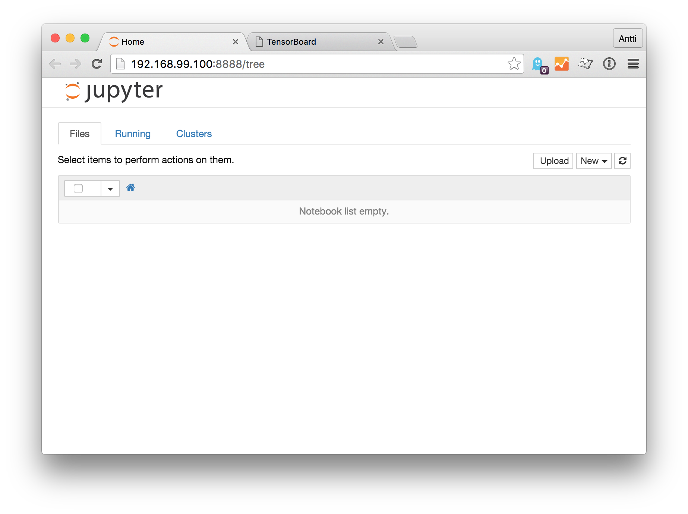
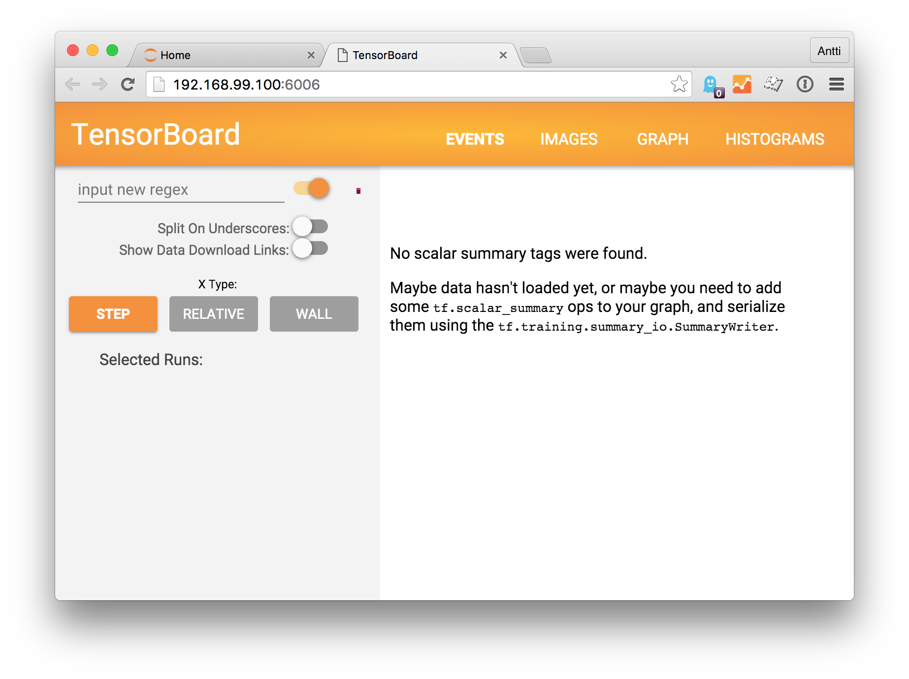

## Installation instructions

If you don't have Docker installed already:

- On Linux, [install Docker](https://docs.docker.com/linux/step_one/)
- On OS X or Windows:
    + [Install Docker Toolbox](https://www.docker.com/products/docker-toolbox)
    + Run the Docker Quickstart Terminal application and use that as your shell for the rest of this tutorial

Then run the following commands:

```bash
# Clone this repository
git clone git@github.com:tarvaina/tensorflow-tutorial.git
cd tensorflow-tutorial

# Download the TensorFlow docker image
docker pull b.gcr.io/tensorflow/tensorflow

# Create container "jupyter" running Jupyter Notebook at port 8888
docker run \
    --name jupyter \
    -d \
    -v $(pwd)/notebooks:/root/notebooks \
    -v $(pwd)/logs:/root/logs \
    -p 8888:8888 \
    b.gcr.io/tensorflow/tensorflow \
    /run_jupyter.sh /root/notebooks

# Create container "tensorboard" running TensorBoard at port 6006
docker run \
   --name tensorboard \
   -d \
   -v $(pwd)/logs:/root/logs \
   -p 6006:6006 \
   b.gcr.io/tensorflow/tensorflow \
   tensorboard --logdir /root/logs
```

Now you can open browser windows for Jupyter Notebook and TensorBoard:

+ On Linux: open [http://localhost:8888](http://localhost:8888) and [http://localhost:6006](http://localhost:8888)
+ On OS X, run `open http://$(docker-machine ip):8888  http://$(docker-machine ip):6006`

If everything went fine, you should see something like this:




Congratulations, you have installed the tutorial environment!

You can now open the notebook "01 Test installation" in Jupyter and follow its instructions to check that TensorFlow is indeed working.
